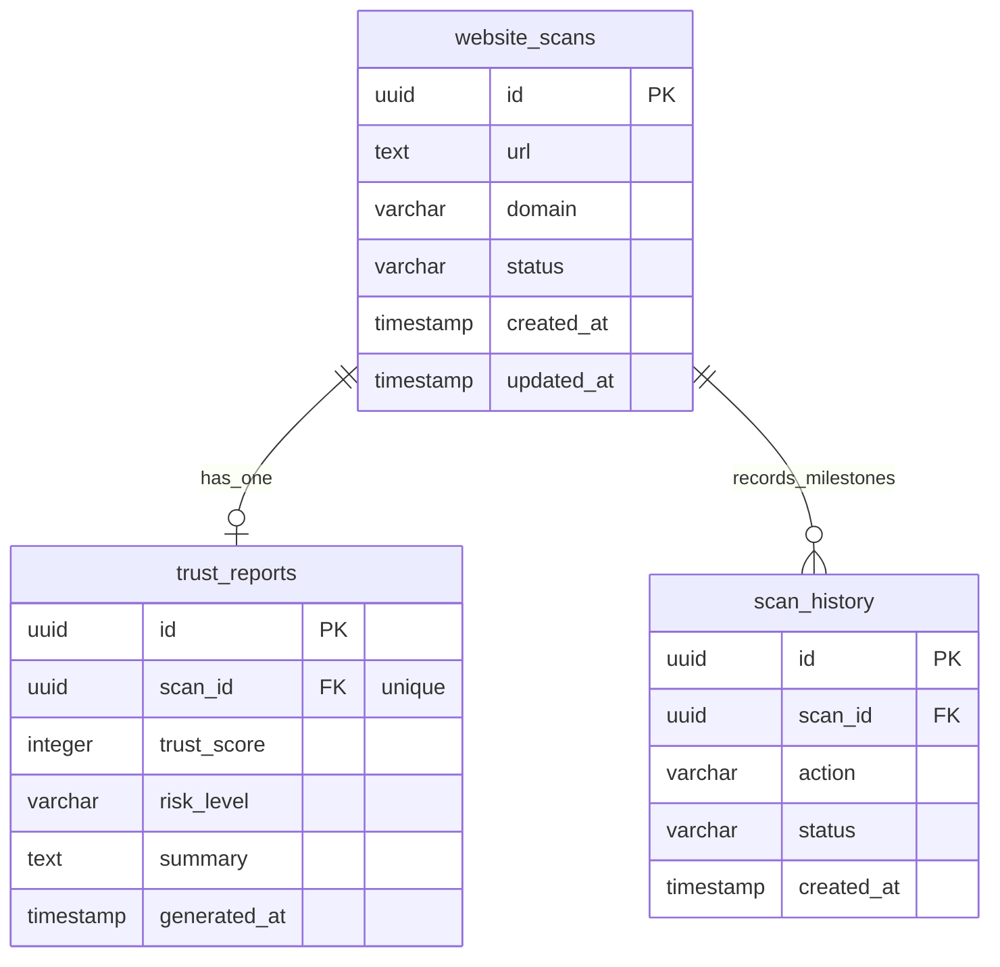

# TRUSTINEL - Sprint 2 Entity-Relationship (ER) Diagram

This document contains the structural relationship representation for the **TRUSTINEL** Sprint 2 PostgreSQL database schema.

---

## 🗺 Relationships Explanation

### 1. website_scans ↔ trust_reports (1:1)
- **Rule**: Each `website_scans` row represents a distinct scanning trigger. Once completed, it produces exactly one `trust_reports` record.
- **Join Cardinality**: `1:0..1`. A scan record starts with no report (0), and once successfully executed, it gains exactly one report (1). The connection is linked via `trust_reports.scan_id` (which carries a `UNIQUE` constraint).

### 2. website_scans ↔ scan_history (1:N)
- **Rule**: A scan progresses through lifecycle milestones (e.g. initiated, processing, succeeded, failed). Each step is logged.
- **Join Cardinality**: `1:1..N`. Every scan has at least one starting log entry, and can accumulate multiple history items over its lifecycle.

---

## 📊 Mermaid ER Diagram

